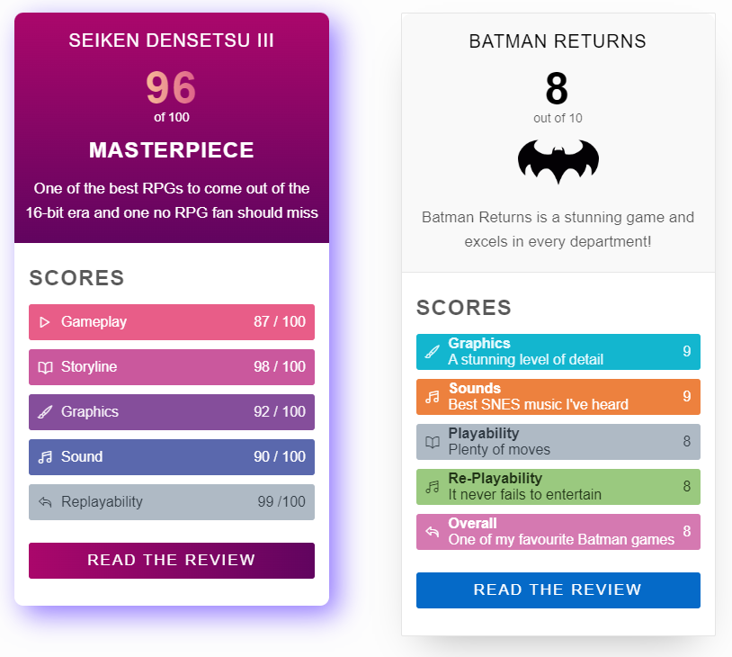
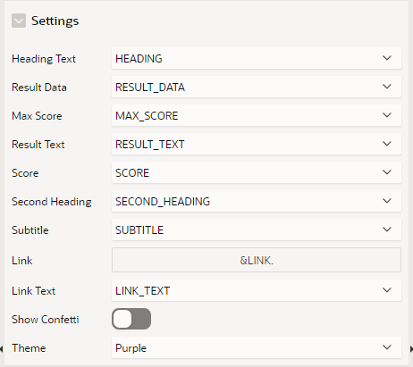
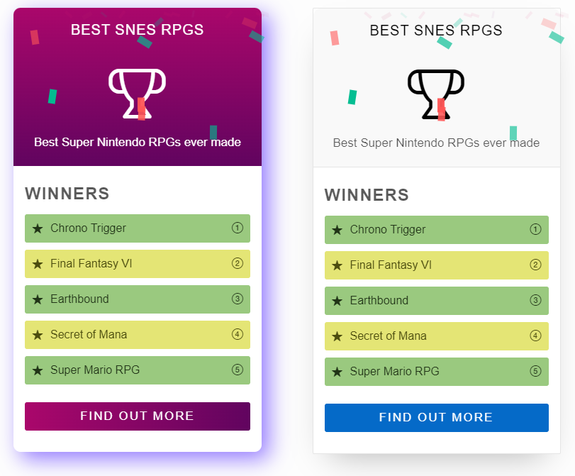

# Summary Card Template Component

Displays Summary and Detail values in the style of a retro video game magazine review. 

- Usable as Single

## Preview


## Demo Application
You can find a Demo Application [here](https://apex.oracle.com/pls/apex/r/luf/challenge)

## How to use
1. Download the plug-in file from the latest release
2. Import the plug-in file into your application
3. Create a new region of type "Summary Card"
4. Add SQL Query like this

```sql
with data as (
 SELECT 'u-color-10 u-color-10-bg' class, 'fa fa-play' icon, 'Gameplay' category, '87 / 100' score, 1 sortorder FROM DUAL UNION ALL
 SELECT 'u-color-11 u-color-11-bg' class, 'fa fa-book' icon, 'Storyline' category, '98 / 100' score, 2 sortorder FROM DUAL UNION ALL
 SELECT 'u-color-12 u-color-12-bg' class, 'fa fa-paint-brush' icon, 'Graphics' category, '92 / 100' score, 3 sortorder FROM DUAL UNION ALL
 SELECT 'u-color-13 u-color-13-bg' class, 'fa fa-music' icon, 'Sound' category, '90 / 100' score, 4 sortorder FROM DUAL UNION ALL
 SELECT 'u-color-14 u-color-14-bg' class, 'fa fa-reply' icon, 'Replayability' category, '99 /100'score, 5 sortorder FROM DUAL
)
select 'Seiken Densetsu III' heading,
       96 SCORE,
       'of 100' MAX_SCORE,
       'MASTERPIECE' SECOND_HEADING,
       'One of the best RPGs to come out of the 16-bit era and one no RPG fan should miss' SUBTITLE,
       'Scores' RESULT_TEXT,
       'Read the Review' LINK_TEXT,
       'https://gamefaqs.gamespot.com/snes/588648-seiken-densetsu-3/reviews/62340' LINK,
       ( SELECT JSON_ARRAYAGG(JSON_OBJECT(*) ORDER BY sortorder ) FROM DATA ) RESULT_DATA 
from dual
```

> Its important that the detail is selected with the following column aliases
>
> - class : For text and background colours
> - icon : Icon in the first position
> - category : The wording for the detail
> - score : The score or grade e.g 83/100 or B+
> - sortorder : For sorting in the main query

5. Assign Attributes as below



## Other Ideas



## Version History

### 23.2.1 (Dec 2023)

#### Fixes
- Fixed button link
- Adjusted the confetti z-index (allows modals to close)
- Removed redundant HTML attrbutes post-render

#### Enhancements
- Button only appears when Link is present + corrected margin
  - For a more compact view, use a NULL Result_Text and a NULL Link.
- Added Themes
  - Purple (Default) : Original Purple Theme 
  - Universal : Aligned to the Universal Theme. Use this for Theme consistent colours + Dark Mode support.

### 23.1.1 (Aug 2023)
- Initial Release

## Credits

Credits to Sabbir Ahmed (https://uiverse.io/profile/sabbircoder07) for the original HTML+CSS

Adapted to APEX by Matt Mulvaney (https://x.com/Matt_Mulvaney)

## Donations

Donations to [Saint Michael's Hospice](https://saintmichaelshospice.org/support-our-work/donate/one-off-donation/) are welcome
